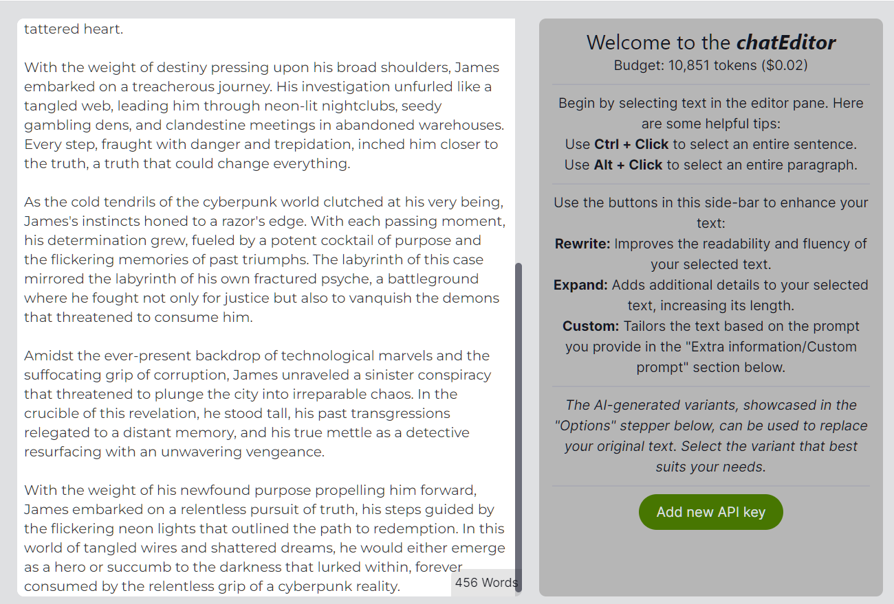
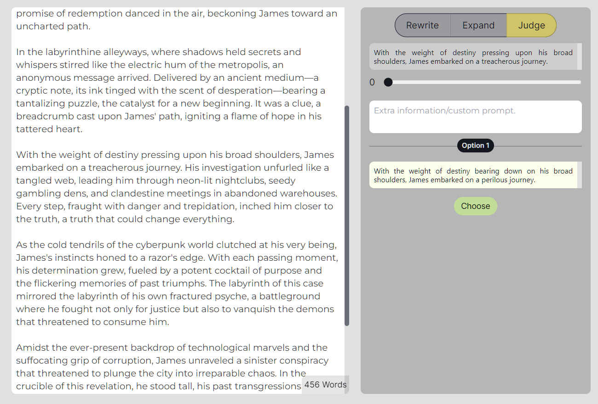
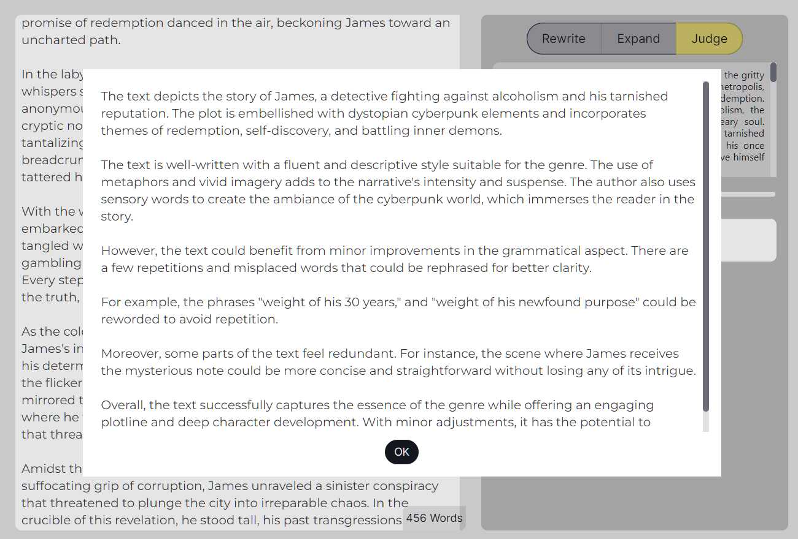

# chatEditor

## Introduction

chatEditor is a powerful tool designed to aid writers in utilizing large language models (LLMs) effectively. Understanding how to write effective prompts for these LLMs can be challenging. chatEditor simplifies this process by providing an intuitive interface to interact with LLMs, allowing users to improve their writing skills.


<details>
  <summary>See more app screenshots</summary>
  
  
</details>

## How to Write Effective Prompts?

Large language models (LLMs) are predictive tools that generate text based on the input they receive. They operate by predicting the next word, or token, in a sequence, one at a time. However, the way they function is fundamentally different from the human writing process. Humans have the ability to envisage a complete narrative, no matter how vague or precise, and direct their writing accordingly.

LLMs, on the other hand, lack this foresight. Consequently, it's up to us to guide them effectively. But how do we achieve this?

The answer lies in providing a rich context.

For instance, instead of instructing an LLM with a vague command like `Write a book about cyberpunk crime-solving`, a more productive approach is to provide a specific, detailed context:

```
Enhance the text below by adding richer vocabulary and more detail:

Synopsis: James was a detective in a cyberpunk world.
At the age of 30 and battling alcoholism, he longed for
one case that would establish his credibility. And then,
one day, an unexpected event unfolded. (What was it?)
```

By doing so, the LLM has a better reference point and can generate text that aligns closely with our intent, effectively guiding the text generation process.

The purpose of chatEditor is to make this complex task simpler and more accessible. It presents users with an intuitive interface where they can easily prompt the LLM to rewrite or expand upon selected sentences or paragraphs. Moreover, they can provide custom prompts or ask the AI to critique their text, identifying potential areas for improvement. The goal is to empower users to fully leverage the capabilities of LLMs, all within a user-friendly environment.

## Features

chatEditor can:

- **Rewrite text**: Users can select a sentence, paragraph, or even multiple paragraphs and ask the LLM AI to rewrite it for them.
- **Expand on text**: Users can ask the LLM AI to add more details to a selected piece of text.
- **Custom prompts**: Users can provide custom prompts, enhancing the flexibility and specificity of the output.
- **Critique text**: Users can also ask the AI to judge their text, identifying flaws and areas for improvement.

## How To Use

After installing and starting chatEditor, you'll interact with a user-friendly interface designed to help you create more effective prompts for LLMs.

To get started:

1. Begin by selecting text in the editor pane. Use Ctrl + Click to select an entire sentence or Alt + Click to select an entire paragraph.
2. Use the buttons in the side-bar to interact with the AI:

- **Rewrite**: Improves the readability and fluency of your selected text.
- **Expand**: Adds additional details to your selected text, increasing its length.
- **Custom**: Tailors the text based on the prompt you provide in the "Extra information/Custom prompt" section below.

3. The AI-generated variants, showcased in the "Options" stepper below, can be used to replace your original text. Select the variant that best suits your needs.

## Installation

To use chatEditor, clone this repository and use Node.js to create a server.

## How to use?

Close this repo, use node-js to create a server.

## TO-DO list

- [ ] Develop a website for easier user access
- [ ] Add options for using different models
- [ ] Improve CSS to enhance user interface
- [ ] Fix issues with the stepper (completed steps)
- [ ] Add streaming to chat
- [ ] Refine context management in chatGPT to avoid unwanted rewriting
- [ ] Add an overlay to the textarea for constant visibility of selected text

## Contributing

Contributions are welcome! Please create an issue to discuss the changes before making a pull request.

## License

This project is licensed under the MIT License. See the [LICENSE](LICENSE) file for details.

Thank you for considering chatEditor for your writing needs!
